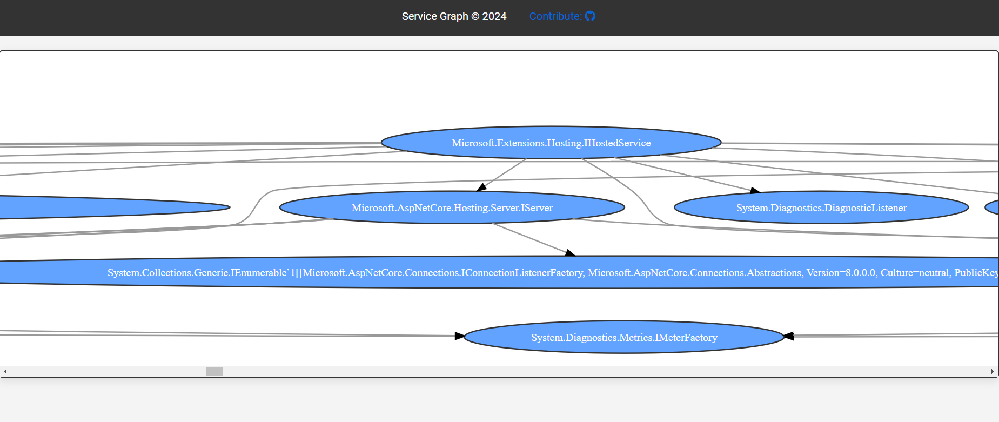

# ServiceGraph

ServiceGraph is a C# library designed to visualize and manage the dependencies between services in a microservices architecture. This tool helps developers and system administrators understand and maintain the complex web of interdependencies in modern software systems.

## Features

- **Dependency Visualization**: Displays a graphical representation of service dependencies.
- **Circular Dependency Detection**: Identify and highlight circular dependencies to prevent potential issues in your microservices architecture.
- **Interactive Graph**: Nodes and edges are clickable, providing detailed information about each service and its dependencies.
- **Scalability**: Efficiently handles large numbers of services and dependencies.
- **Customizable Views**: Filter and organize the graph to focus on specific aspects of the system.

## Installation

To set up and run ServiceGraph locally, follow these steps:

1. **Clone the repository**:
    ```bash
    git clone https://github.com/nakkayev1707/ServiceGraph.git
    cd ServiceGraph
    ```

## Usage
#### Web Applications:

```
builder.Services.AddScoped<IYourService, YourService>();
...

// make sure that you are in dev. environment
app.UseServiceGraphUI(builder.Services, new ServiceGraphOption
{
   Namespaces = new []
   {
      "Your.Custom.Namespaces"
   }
});

// or * to include all namespaces 

app.UseServiceGraphUI(builder.Services, new ServiceGraphOption
{
  Namespaces = new []
  {
      "*"
  }
});

```
## UI:



## Contributing

Contributions are welcome! If you have ideas for improvements or find any issues, please clone the repository and submit a pull request. Follow these steps to contribute:

1. clone the repository.
2. Create a new branch (`git checkout -b feature/your-feature`) from master branch.
3. Make your changes.
4. Commit your changes (`git commit -m 'Add some feature'`).
5. Push to the branch (`git push origin feature/your-feature`).
6. Open a pull request.

## License

This project is licensed under the MIT License. See the [LICENSE](LICENSE) file for details.

## Contact

For any issues or inquiries, please contact the project maintainer at ismailnakkayev@gmail.com.

## Topics

C#, Microservices, Dependency Management, Visualization, Interactive Graph
